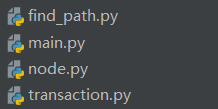
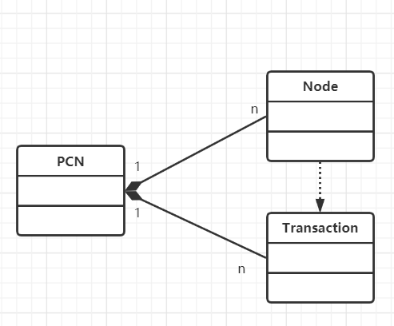
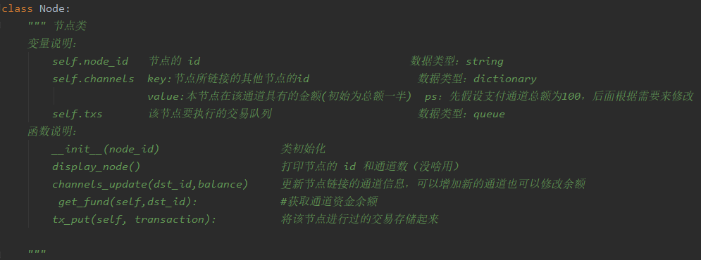
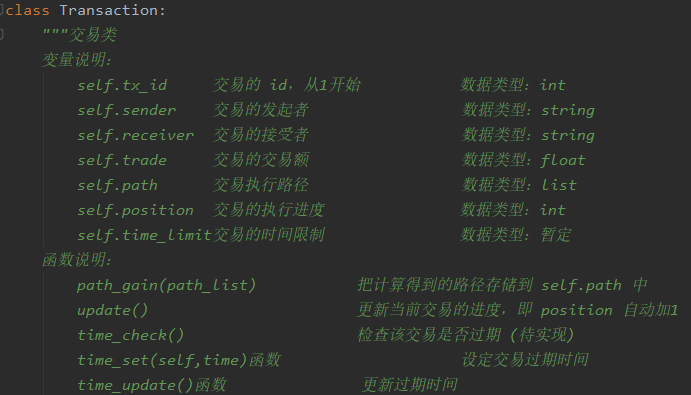
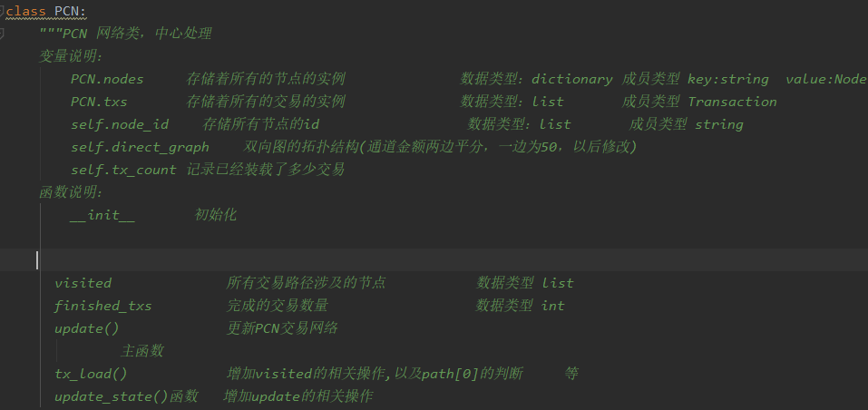
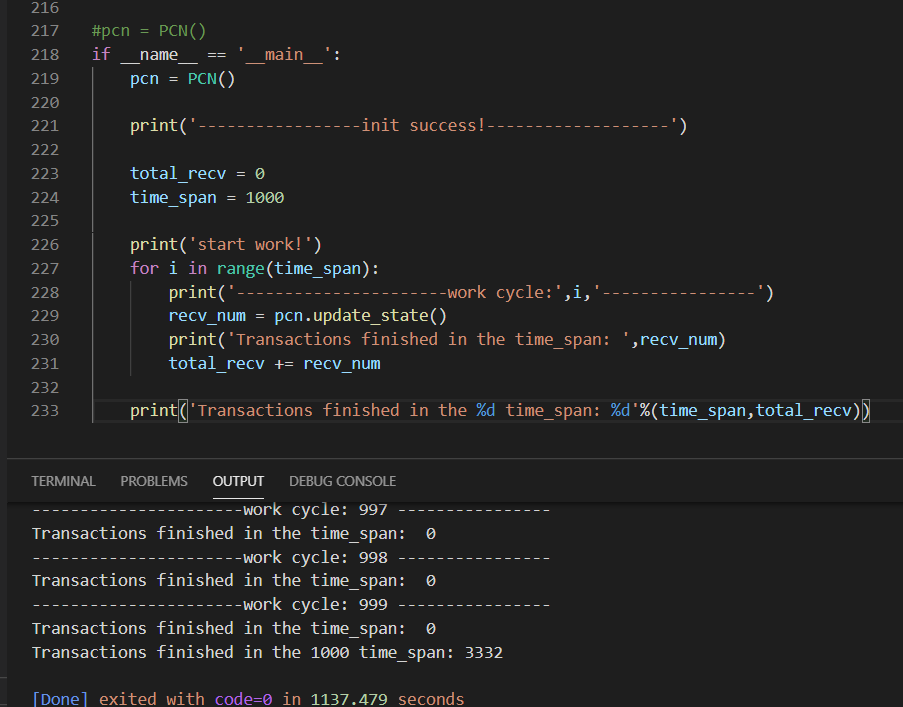

# 构建支付通道网络模型

| 组号 | B       |
| ---- | ----------- |
| 组长 | 张子恩 + 17343159  |
| 成员 | 冯上清 + 17343027 |
| 成员 | 许泰琪 + 17373133 |

## 1. 任务分工
根据任务要求，我们讨论了PCN网络模型中三类的具体实现细节：

- Node类
- Transaction类
- **PCN类**

最终将任务重点落在PCN类上，根据我们的讨论，PCN的实现可大致表达为：

```c
PCN{
	list nodes[];
	queue txs[];   //
	topo;        //网络拓扑结构
	
	int count;   //每time_span完成的交易数
	list visited；//所有交易涉及的节点，利用此列表更新网络拓扑结构，而不遍历所有节点，减少工作量
	init(){         
		nodes.init(); //ripple_topology.json 数据初始化节点列表
		topo.init();  //ripple_topology.json 得到通道列表
						//利用work2 数据得到通道资金分布(平分)
		txs.init();   //选取work2的部分交易，				
	}
	update_state(){
		 tx_load(){
            //每隔一定时间t = 1/30s从txs中取出一定数量的交易。
            //拷贝一个拓扑结构的副本
            //根据拓扑结构副本依次为每笔交易计算路径（最大路径算法），并将路径节点记录在visited，
            //每次计算出路径之后更新拓扑结构副本
            visited[];//
            //将交易加入路径起点的交易队列
            //继续计算下一个交易路径并继续
        }
        update(){
            //每隔一定时间t，每个节点(并行)可以处理交易队列中的一笔交易。
            //遍历visited的节点A，取出A的交易队列中的第一个T
            //若T.position = len(path) - 1,表示此交易终点为A，（交易完成数+1），进行下一步；交易过期则直接进行下一步
            //取下一个交易T2,
            //若通道资金足够
            //    1)将T2发送到下一个节点（加入下一个节点的交易队列并更改position）
            //    2)并更改拓扑结构；
            //    3)更新交易过期时间
            //否则直接更新交易过期时间（交易无法发送也要更新交易过期时间）      
        }
	}	
}
		//注：我们将2000t视为一个交易的过期时间
```

根据工作量和任务难度，我们进行了如下分工：

|        | 分工                                                      |
| :----- | :-------------------------------------------------------- |
| 许泰琪 | Node类，Transaction类，PCN的init()以及tx_load()非寻路部分 |
| 张子恩 | 最宽路径算法+ppt                                          |
| 冯上清 | 检查并修改以上内容，最终实现update()部分                  |


## 2. 项目结构和实现步骤
### 项目如下：<br>



>find_path.py 寻路算法，寻找两个点之间最最大流路径<br>
>node.py  node类实现<br>
>transaction.py   交易类实现
>
>main.py实现PCN网络模型并输出相关信息，下图为采用1/20交易数据进行测试时的输出示例：

### UML图


### 实现步骤
* 1. 实现各类参数以及方法
  
  `node`类：
  
  节点的作用：记录该节点的相关交易；记录与其他节点的通道信息；

  `transaction`类
  
  说明：交易类实现，除了默认的标识，接收方信息以及交易额以外。我们还添加了执行路径，进度以及交易时间限制。
  >执行路径：由于随着不断地交易，两个点之间最大流路径也会随之改变，需要更新记录这笔交易两个点之间最大流路径
  >进度：记录交易走到路径那个节点上
  >交易时间限制：设定时间检查交易是否过期

  `PCN`类 :作为支付通道网络的抽象
  
  1. 属性：节点列表，交易列表，拓扑结构信息等
  2. 拓扑结构初始化：
     - 使用Ripple 某一天的拓扑数据，从文件中读取用于初始化节点列表和拓扑结构
     ~~~python
     data = pd.read_table('all-in-USD-trust-lines-2016-nov-7.txt', header=None,
                             encoding='unicode-escape', delim_whitespace=True,
                             names=['src', 'dst', 'lower_bound', 'balance', 'upper_bound'])
     ~~~
     - 由于我们并不知道通道初始余额的大小，我们假设通道一开始是完全平衡的，资金平等地分配到通道的两端，采样自part2提供的数据集
     ~~~python
      self.dic_graph.add_weighted_edges_from(
                    [(data['src'][i], data['dst'][i], 50.0), (data['dst'][i], data['src'][i], 50.0)])  # 有向图添加边，金额平分
     ~~~
     - 拓扑结构更新
       * 寻找交易最大流路径
         ~~~python
          path = find_biggest_weight_path(graph_copy, tmp.sender, tmp.receiver)
         ~~~
       * 在双向拓扑图中把 path 执行
         ~~~python
          for j in range(len(path[0]) - 1):
             graph_copy[path[0][j]][path[0][j + 1]]['weight'] -= tmp.trade
             graph_copy[path[0][j + 1]][path[0][j]]['weight'] += tmp.trade
         ~~~


   1. 交易信息初始化：

    - 发送节点ID和接收节点ID：
      * list数据类型存储数据集交易
      * 基于上次作业使用的交易数据，通过每笔交易确定发送节点和接收节点
    - 交易的大小：基于历史数据的采样（part2的数据集）
      * 采用上次作业文件的前1/20的数据，因为存在关键节点，大部分交易流经关键节点，所以前1/20的数据中关键节点所占比例较大
    
    - 产生时间：我们假设PCN中交易以一定的速率生成（参考[1]的实验设置，**30tx/sec per sender** ?） 
      * 每隔三百毫秒，进行9次更新，每次更新从交易中取出30笔交易，进行交易。

* 2. 最大流路径算法实现
   >思路：采用深度搜索算法找出两个点所有路径，从路径中寻找权值最大的那一条
* 3.  更新PCN状态：

  ~~~c
       //每隔三百毫秒，进行9次更新，每次更新从交易中取出30笔交易
      //遍历visited的节点A，取出A的交易队列中的第一个T
      //若T.position = len(path) - 1,表示此交易终点为A，（交易完成数+1），进行下一步；交易过期则直接进行下一步
      //取下一个交易T2,
       //若通道资金足够
           //    1)将T2发送到下一个节点（加入下一个节点的交易队列并更改position）
           //    2)并更改拓扑结构；
           //    3)更新交易过期时间
        //否则直接更新交易过期时间（交易无法发送也要更新交易过期时间）      
  ~~~


注：选择遍历visited中的元素对应的节点，简化更新拓扑结构的时间

输出示例（采用1/20交易数据进行测试）：



## 3. 总结与思考

1.  通过建议PCN模型的实现，了解了PCN网络交易过程中，路径的不断变化。由于交易的不断产生，单方向的通道资金不断发生变化，交易路径往往选择路径权值最大的那条路实现。
2. 我们实现的模型具有一定的局限性。PCN定期取出一定数量的需要处理的交易，并逐个为其寻路，然后将其加入节点的交易队列。在上述操作完成后，才开始逐个处理相关节点的交易队列中的第一笔交易。PCN和节点的工作是串行和不是并行，相关节点发送交易本质上还是串行，有一定的改进空间.
3. 我们的模型在数据的使用方面存在一些局限，一开始准备使用TA 提供的 json 文件的内容，但是初始化好数据结构后，想不出比较合理的方法来生成交易，所以只能退而求其次，使用上次作业的交易集。


